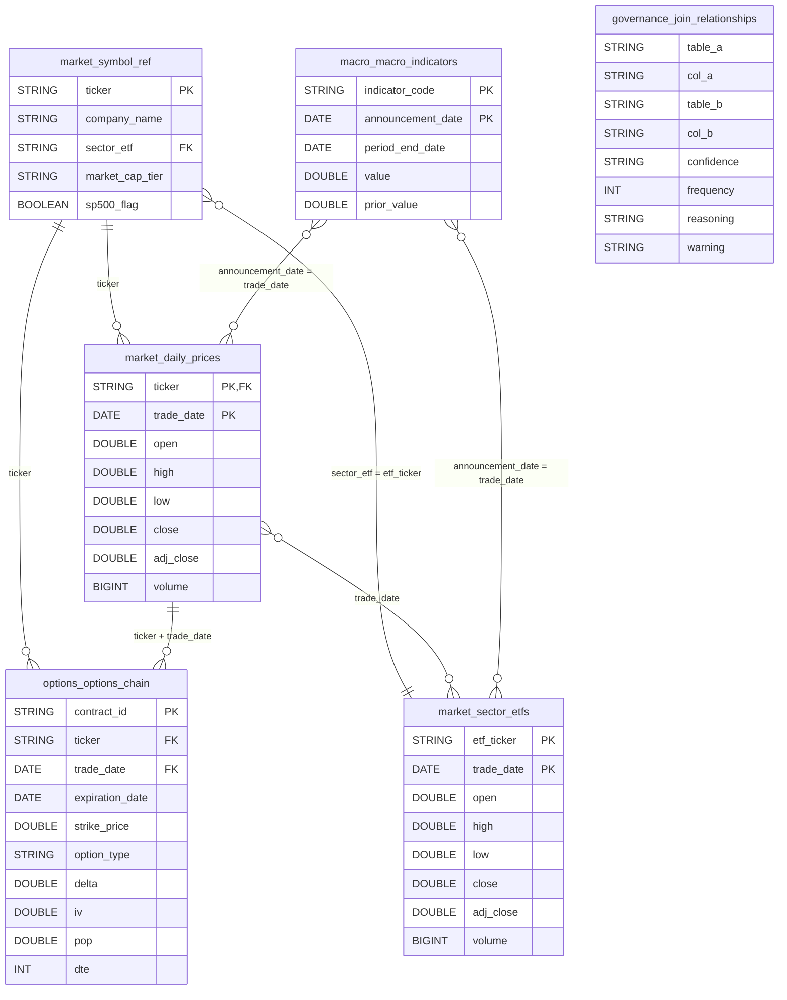

# Extracting Join Key Relationships from DDL and Query History

Local demo that uses an LLM to figure out how tables should be joined, based on their DDLs and actual query history.

DDLs alone give you some join relationships, but real query history tells you which joins people actually use and how often. Combining both gives better results and catches "bad" joins (i.e. joining on `period_end_date` instead of `announcement_date`).

## In Repo

- 2 years of stock data (10 semiconductors, 10 banks), sector ETFs (XLK, XLF), VIX via `yfinance`, and FRED macro data
- Store everything in local Apache Iceberg tables (PyIceberg writes, DuckDB reads)
- 20 sample generated SQL queries that join across the tables in various ways
- sqlglot parses those queries to extract a join frequency map
- LLM runs twice: once with DDLs only, once with DDLs + query history
- Compare the two runs to see what query history adds (more relationships, warnings on bad joins)
- Final results stored in an Iceberg `governance.join_relationships` table

## Tables/DDLs

- `market.daily_prices` - OHLCV for 20 tickers
- `market.symbol_ref` - ticker metadata (sector, cap tier)
- `market.sector_etfs` - XLK/XLF daily prices
- `options.options_chain` - current options snapshots for NVDA, AMD, JPM
- `macro.macro_indicators` - FEDFUNDS, GDP, VIX
- `governance.join_relationships` - the AI-extracted join keys

### ER Diagram (Mermaid)

## Tools

PyIceberg (write) + DuckDB iceberg_scan (read) + SQLite catalog, sqlglot for query parsing, and Claude for join extraction
